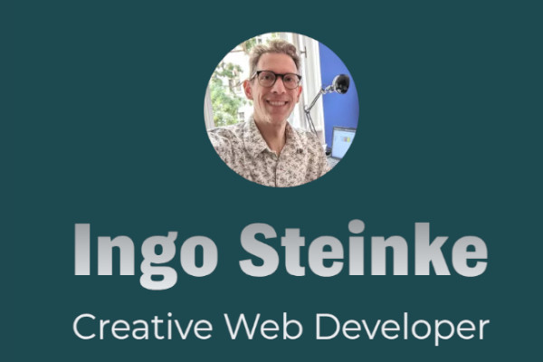

# Ingo-Steinke.de

Portfolio website for [Ingo Steinke, creative web developer](https://www.ingo-steinke.com/).
German version: <a hreflang="de" href="https://www.ingo-steinke.de/" target="_blank">Ingo-Steinke.de</a>

This is a simple, static, multilingual website using eleventy as a JAMstack tool to facilitate content editing and deployment.
Accessibility and web performance are important non-functional requirements.

This website can be used to showcase best practices, try new CSS features using progressive ehancement, 
and to save CV documents using the print dialog.

My [changelog](./CHANGELOG.md) contains details about features and fixes.

This is a screenshot after the relaunch in 2021:



## Generate updated CV PDFs

Print the "about me page" to a PDF file to generate an updated CV. Optionally (and experimentally), add the query string
parameter `pdf=embed` to the URL to embed a prepared PDF document, e.g. to append certifications. This seems to work
in **Firefox** 130, but not in Chrome 128 or Vivaldi 6.9.

- https://www.ingo-steinke.de/ueber-mich.html?pdf=embed
- https://www.ingo-steinke.com/about-me.html?pdf=embed

- `npm run serve` && open http://localhost:1974/ueber-mich.html?pdf=embed
- `npm run serve:en` && open http://localhost:1974/about-me.html?pdf=embed

## Development Requirements

- npm
- eleventy (global path: `npm install -g @11ty/eleventy`)
- a computer with an internet connection
- linters and testing tools will be installed by npm

### Frontend Debugging

To use `console` functions like `console.log`, set `"removeConsole"` to `false` in `babel.config.json` !

## Edit Content

### Project Structure

- `src/index.liquid` (site structure, image tags etc.)
- `src/_data/**/content.js` (localized strings)
- `img` (image files)
- `styles.css`, `_includes/*.css`(styles: CSS + PostCSS)

#### Sub-pages

- `src/{__slug__}/index.liquid`
  - include common page parts from `src/_includes/`
  - processed, built and added to sitemap
- Common parts are not used for the (index.liquid) home page.

##### Offers/services (Leistungen)

Section to be added above "skills", replacing "skills" as a top navigation item, to add pages focused on the customers' perspective rather than the who-I-am-CV-perspective that the website started with. These pages must be provided in all languages.

 - [Web development](https://www.ingo-steinke.com/services/web-development.html) / [Webentwicklung](https://www.ingo-steinke.de/leistungen/webentwicklung.html)
 - [Website check](https://www.ingo-steinke.com/services/website-check.html) / [Web-Check](https://www.ingo-steinke.de/leistungen/website-check.html)
 - [Optimization](https://www.ingo-steinke.com/services/optimization.html) / [Optimierung](https://www.ingo-steinke.de/leistungen/optimierung.html)

##### Campaign landing pages

Keyword-centered additional landing pages, manually added in German only for specific campaigns and linked from the German footer only, should also be provided in all languages for more consistency.

- [Sustainability](https://www.ingo-steinke.com/services/accessible-climate-website-optimization.html) / [Nachhaltigkeit](https://www.ingo-steinke.de/webseiten-klimafreundlich-barrierefrei-optimieren/)
- [Freelancer web developer Berlin](https://www.ingo-steinke.com/services/freelance-webdeveloper-berlin.html) / [Web Freelancer Berlin](https://www.ingo-steinke.de/leistungen/webentwickler-berlin-freelancer.html)
- [Certified Shopware Developer](https://www.ingo-steinke.com/services/certified-shopware-developer-berlin.html) / [Zertifizierter Shopware-Webentwickler](https://www.ingo-steinke.de/zertifizierter-shopware-6-frontend-webentwickler/)

### Localization / text snippets

Text content can be edited in

```src/_data/{{ content.language }}/content.js```

to be used in liquid variables with the `content.` prefix.

My localization setup does not match eleventy's front matter handling,
but this proved a quick and maintainable way to get things done.

When starting to work with eleventy, in January 2021, I had not been able to find an official documentation
how to internationalize eleventy projects, and anything else I found seemed even more
counter-intuitive to me, so here we go.

## Build

```
npm run build
```

## Test

* `npm run eslint`
* `npm run stylelint`
* `npm run serve` &&
* `npm run codeceptjs` [CodeceptJS](https://codecept.io/)

### Test language versions

* `npm run serve:en`

### Testomat.io synchronization (optional)

export / update local tests to Testomat.io:

* `TESTOMATIO=__$APIKEY__ npx check-tests@latest CodeceptJS "**/*{.,_}{test,spec}.js"`

#### About Testing Tools and the War on Europe
🇺🇦 CodeceptJS and Testomat.io were created in Ukraine. #StandWithUkraine

If the build process fails for any reason, edit `dist` files manually to reflect `src` changes!

## Deployment

### Manual deployment: SFTP / SCP

Upload `dist` content to `ingo-steinke.de` and `dist_en` content to `ingo-steinke.com`.

### Netlify CI (optional, currently deactivated)

- Commits to the master branch will trigger a production deployment by netlify.
- Commits to pull requests will trigger preview builds to a preview domain.

#### Distribution Directories

Distribution directories (`dist`, `dist_en`) are pushed to GitHub.
It is not necessary to re-build them on the "serverless" server,
Netlify can deploy the distributed content without further modification.

#### DNS setup for Netlify

We need to add DNS records for every domain not hosted directly on Netlify:

```
ingo-steinke.de.  IN  A     104.198.14.52
www           IN  CNAME ingo-steinke.netlify.app
```

```
ingo-steinke.com.  IN  A     104.198.14.52
www           IN  CNAME ingo-steinke-com.netlify.app
```

```
ingosteinke.de.  IN  A     104.198.14.52
www           IN  CNAME ingo-steinke.netlify.app
```

```
ingosteinke.com.  IN  A     104.198.14.52
www           IN  CNAME ingo-steinke-com.netlify.app
```

We must configure every domain in Netlify's domain settings as "Custom domains":

| pattern       | de                         | com                          |
| ---               |----------------------------|------------------------------|
| Default subdomain | `ingo-steinke.netlify.app` | `ingo-steinke-com.netlify.app` |
| Primary domain | `www.ingo-steinke.de`      | `www.ingo-steinke.com`         |
| Redirects automatically to primary domain | `ingo-steinke.de`          | `ingo-steinke.com`             |
| Domain alias | `ingosteinke.de`             | `ingosteinke.com`              |
| Domain alias | `www.ingosteinke.de`         | `www.ingosteinke.com`             |

Note that Netlify does not respect `.htaccess` Apache configuration files, but needs a `_redirects` file instead ([see Redirects and rewrites](https://docs.netlify.com/routing/redirects/)).

## Code Style: Pragmatic Minimalism

- Prefer semantic HTML and its built-in defaults,
- prefer CSS to JavaScript,
- follow helpful linter recommendations, deactivate unhelpful rules.
- Compact CSS: composite classes instead of BEM verbosity,
- mix functional and semantic class names pragmatically.
- Prefer naming to code comments, but don't neglect explicit documentation either!
- Always keep the documentation up to date!

## Progressive Enhancement

All content and technical updates must be accessible and should consider web performance and
progressive enhancement: content first, keep the site readable and usable without any style and script,
test tab-navigation, screen reader; use static code analysis (eslint, stylelint), automated audits
(axe, wave, lighthouse); run and update automated test scenarios!

The website should be fully functional and beautifully styled, including animation and interactivity,
using only HTML and CSS without any scripts or images. Saving the website as a PDF using the print dialog
should generate a printable document that resembles the website's style, contains all important information,
including readable and clickable links, and that can be used as a CV document.

DOM elements with visibility controlled by script, like `.sticky-header`,
must always stay visible without javascript, so we hide them by script when the document is ready.

Optional enhancements in `scripts.js`:
- event handling to improve navigation UX
- improve sticky header behavior
- stop animation button
- randomize animation
- control interactive multimedia / videos

## Development Roadmap

- improve test coverage
- upgrade outdated code dependencies
- refactor CSS to improve readability maintainability
- refactor JS: split into testable unit files
- refactor liquid markup: more modular to remove redundancy
- prepare additional pages for project details and older entries
- document and prioritize work using GitHub issues:
https://github.com/openmindculture/ingo-steinke.de/issues/

## Colours

In 2023, Ingo's website introduced high gamut colors to be used on devices supporting extended color definitions. In 2024, the CSS hashtag color was changed from green to [rebeccapurple](https://meyerweb.com/eric/thoughts/2014/06/19/rebeccapurple/) following the W3 community's decision to honor Rebecca Meyer.

## Marketing / SEO

Blog, publish, participate in forums, and add content on free wiki services and profile pages like the following examples where we can create "do-follow backlinks" (i.e. links poiting to our own resouces without a restricting `rel="nofollow"` attribute)

- https://www.open-mind-culture.org
- https://www.patreon.com/ingosteinke
- http://sustainable-web-services.wikidot.com
- https://www.gutefrage.net/nutzer/ingosteinkeseo
- https://github.com/openmindculture
